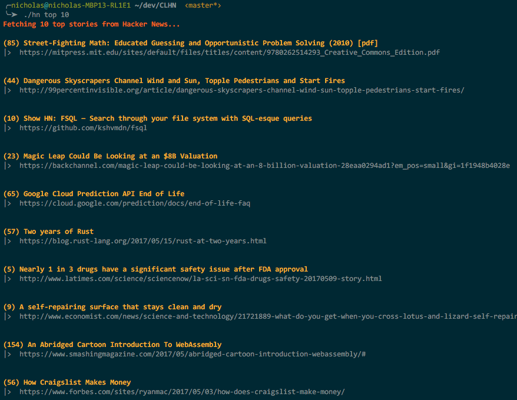

# CLHN

CLHN is a very simple elixir command line application that allows you to glance at Hacker News.



## Usage
```
$ ./hn [best | new | top] [count | 10]
```

## Installation

Simply clone this repo, then build the script by running

```bash
mix escript.build
```

This will output an executable erlang script hn.sh in the root directory of this repository, that you can then call directly with
```bash
./hn top 5
```
